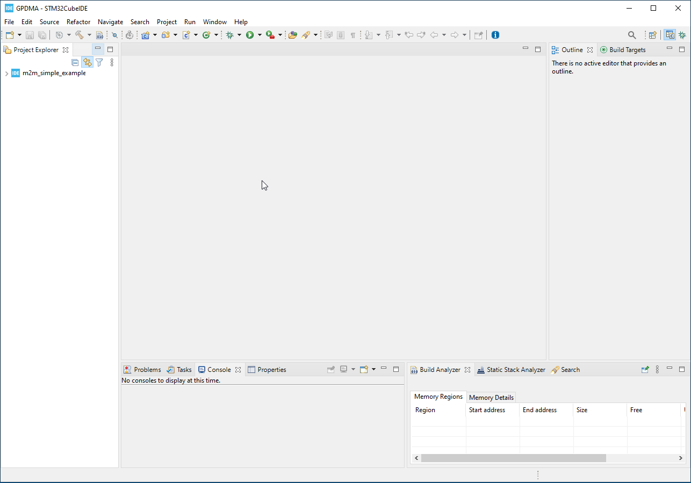
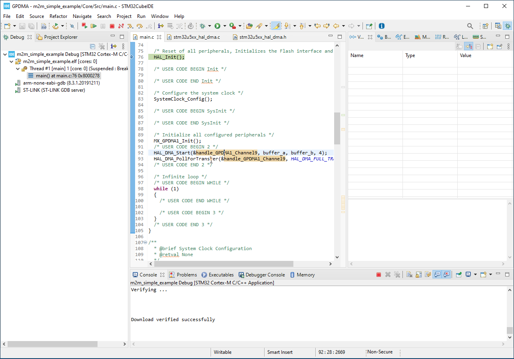

# CubeIDE

1. Import project to CubeIDE [Link](./ide_import_project.md)

<ainfo>
Not neede if you use MX in CubeIDE
</ainfo>


2. Open your `main.c` (by default `ProjectName>Core>Src>main.c`)



3. We add `buffer_a` and `buffer_b` into section `/* USER CODE BEGIN PV */`

```c
uint8_t buffer_a[4]={1,2,3,4};
uint8_t buffer_b[4];
```

Should look like 

```cc
/* USER CODE BEGIN PV */
uint8_t buffer_a[4]={1,2,3,4};
uint8_t buffer_b[4];
/* USER CODE END PV */
```

4. Start GPDMA by `HAL_DMA_Start` adding it into section `/* USER CODE BEGIN 2 */`

```c
HAL_DMA_Start(&handle_GPDMA1_Channel9, buffer_a, buffer_b, 4);
```

should look like 

```cc
/* USER CODE BEGIN 2 */
HAL_DMA_Start(&handle_GPDMA1_Channel9, buffer_a, buffer_b, 4);
/* USER CODE END 2 */
```

## HAL_DMA_Start arguments

`&handle_GPDMA1_Channel9` is GPDMA handle containing information about GPDMA state. In my case i have channel9. 

`buffer_a` - is source buffer from which we will copy data

`buffer_b` - destination buffer where to copy data

`4` - is number of bytes to copy max is 2^16(65k)

<awarning>
GPDMA is counting transfers in bytes even if your source and destination width is word
</awarning>


## Check if DMA finishes

1. To check DMA end we can use function `HAL_DMA_PollForTransfer`

```c
HAL_DMA_PollForTransfer(&handle_GPDMA1_Channel9, HAL_DMA_FULL_TRANSFER, 0x100);
```

Complete section will look like

```cc
  /* USER CODE BEGIN 2 */
  HAL_DMA_Start(&handle_GPDMA1_Channel9, buffer_a, buffer_b, 4);
  HAL_DMA_PollForTransfer(&handle_GPDMA1_Channel9, HAL_DMA_FULL_TRANSFER, 0x100);
  /* USER CODE END 2 */
```

The `HAL_DMA_PollForTransfer` arguments

`&handle_GPDMA1_Channel9` is handle with GPDMA state and configration

`HAL_DMA_FULL_TRANSFER` function is wating to complete GPDMA transfer event

`0x100` timeout where the function will retunr error


<ainfo>
For this example im not checking retunr functions to make it more simple
But in normal situation we would catch also return parameter
</ainfo>

2. Run debug [Link](./ide_debug.md)


3.  Check if `buffer_b` have same content as `buffer_a`



<ainfo>
The code can be runned by `F8`
Double click on left side of editor line `add/remove breakpoint`
Double click on variable allow to `add wariable to watch`(working only if code is **suspended**)
</ainfo>


## Conclusion

We configured GPDMA in MX to after each transfer copy increment soource and destination address. We used `HAL_DMA_Start` to start GPDMA operation and select buffers. We were able to check the GPDMA finish operation by using `HAL_DMA_PollForTransfer`