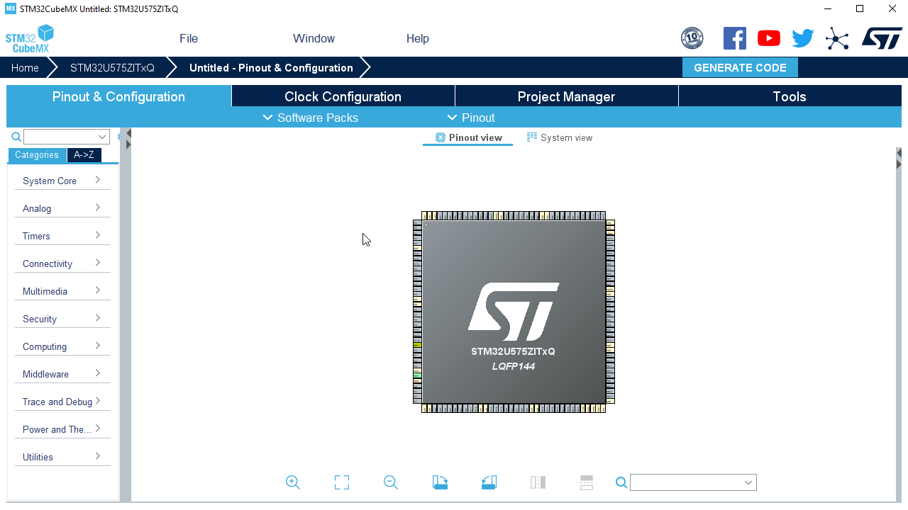
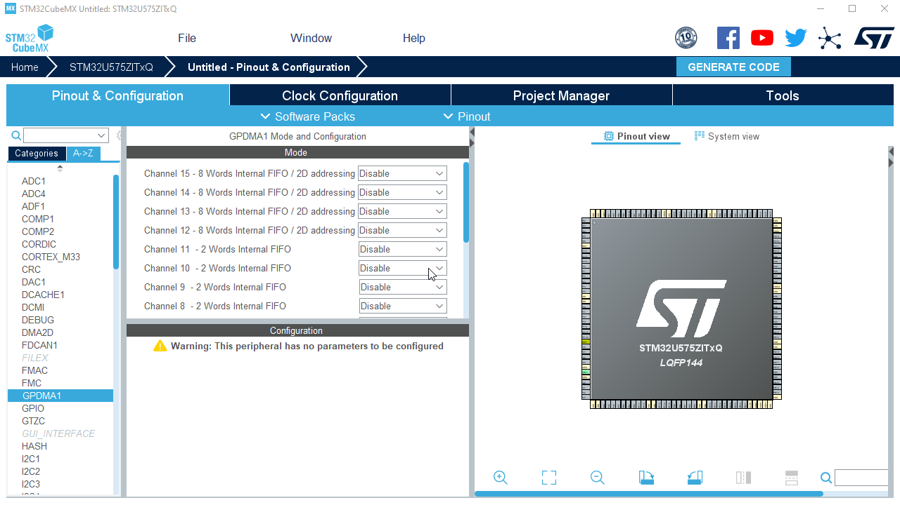
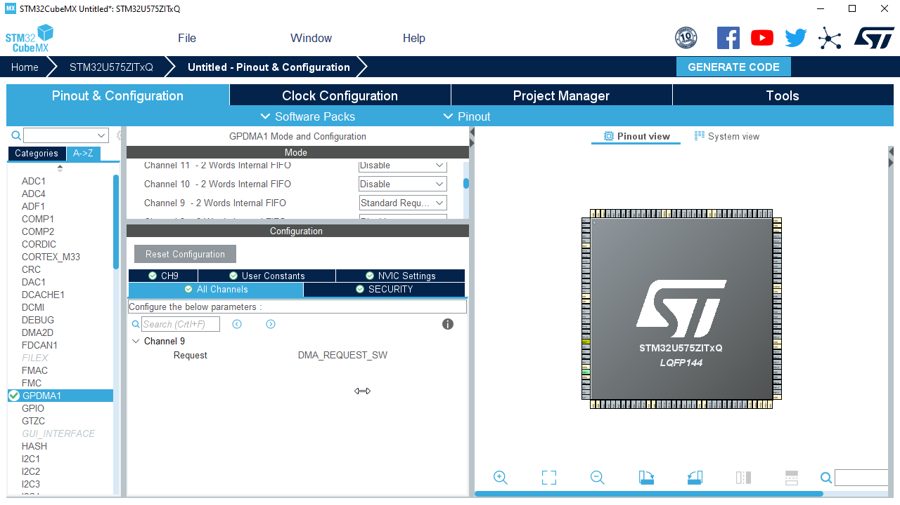
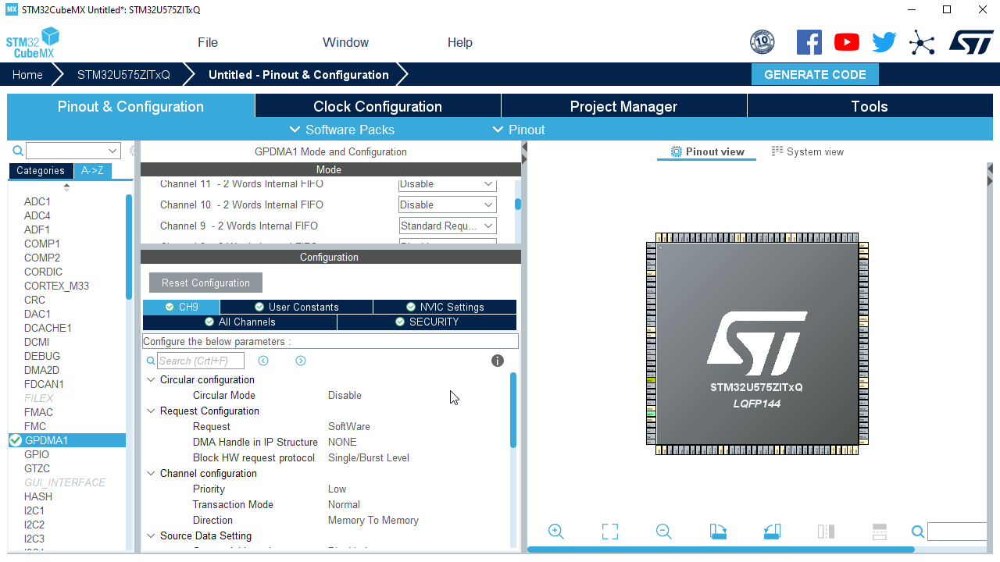

## CubeMX - Step by step creation

1. Create new project

Description is here [Link](./mx_create_project.md)

2. Open `GPDMA` configuration

3. Select GPDMA channel in `Standard request mode` same as `normal mode` on legacy STM32

4. In configuration select channel tab (`CH9`)

   
5. Configurate channel
   
For M2M transfer we need to increment source and destination after each transfer. By default GPDMA channel is set to SW. This means that GPDMA is not waiting to another periphery to request transfer.

Set:

**Destination address increment** to `Enabled`
  
**Source address increment** to `Enabled`

<ainfo>
This configuration allow us to copy all bytes from `buffer_a` to `buffer_b`
</ainfo>

6. Set project name and generate code:

Description is here [Link](./mx_generate_code.md)

<ainfo>
Not neede if you use MX in CubeIDE
</ainfo>