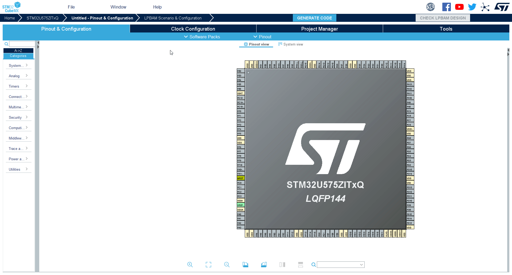

# Configure random GPIO to trigger EXTI

## EXTI constrains

The GPDMA can be triggered by EXTI0 to EXTI7 (pins Px0 to Px7). But on nucleo the button is connected to PC13. We can have two solutions

1. Use wired connection brtween Px0-Px7 and PC13
2. Or we can use sw trick where we scan PC13 and manually set EXTI0-7

## Use PC13 to activate EXTI0

### In CubeMX

1. Set PC13 as input
2. Set PA0(not used on nucleo) as GPIO_EXTI0

<!-- 3. Open GPIO configuration
4. Select PA0 set it as  -->

